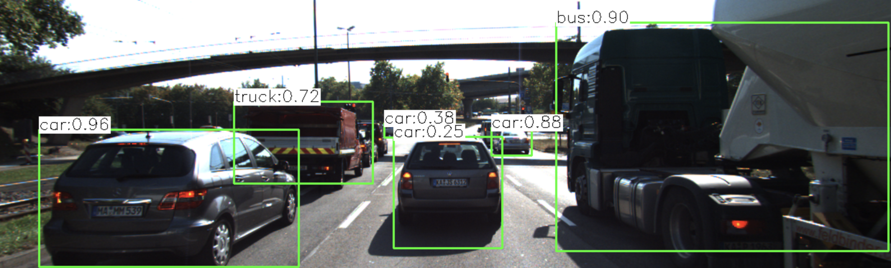
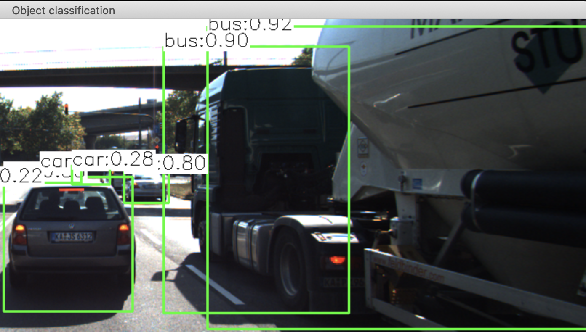
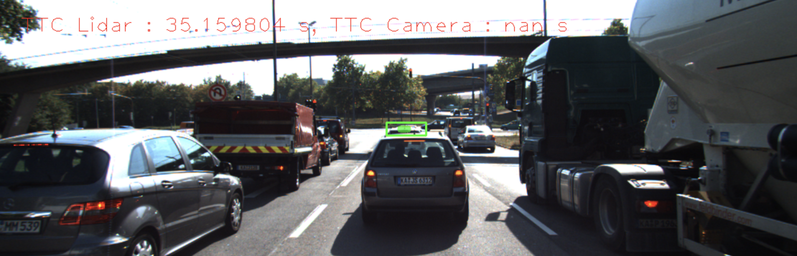
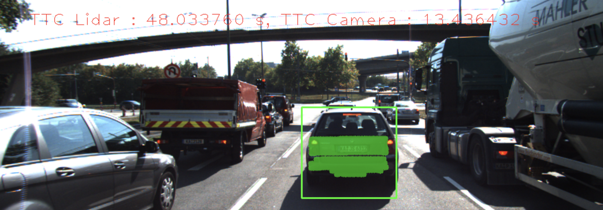
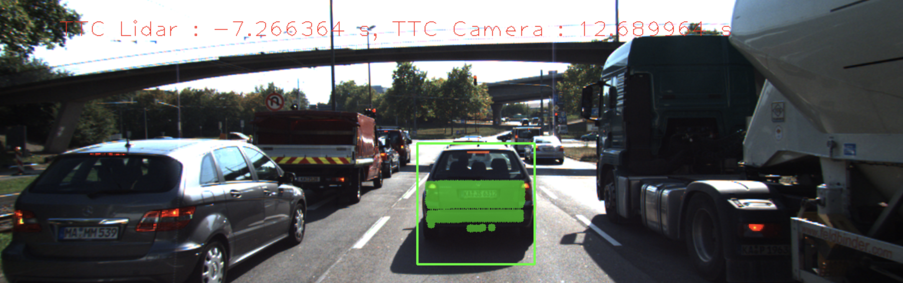
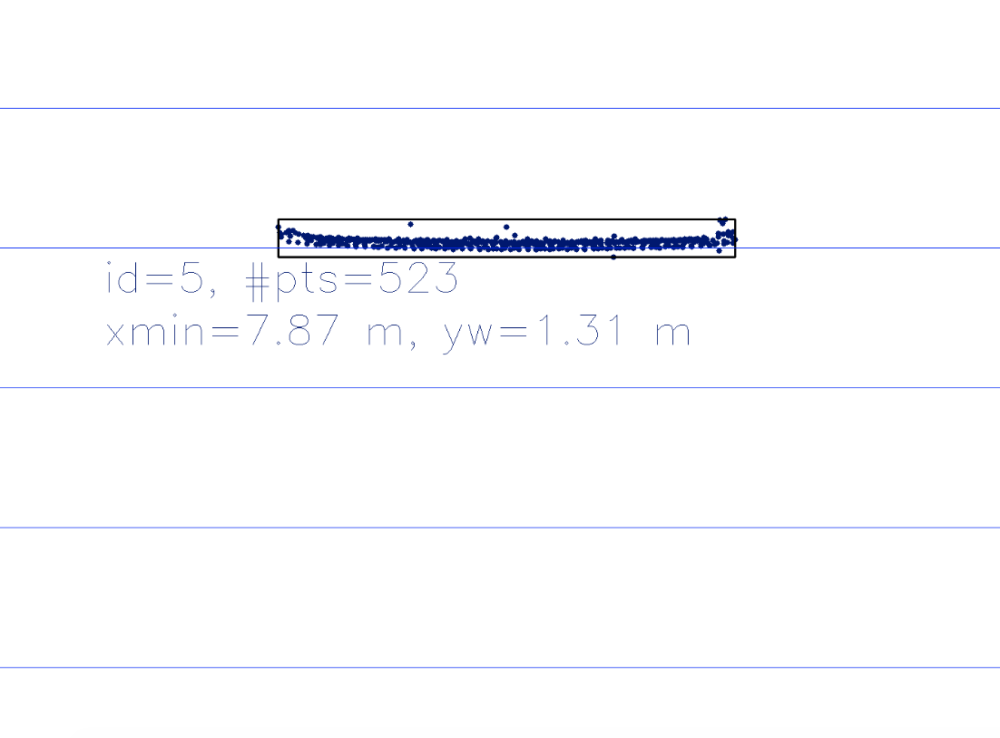
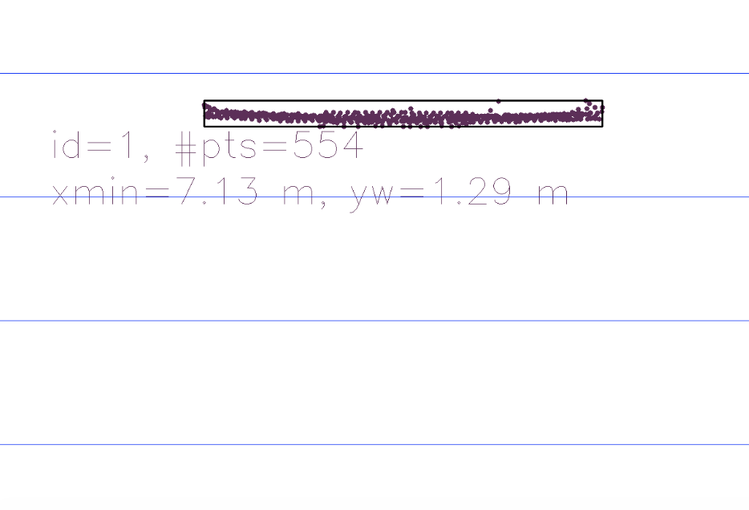

# SFND 3D Object Tracking

Welcome to the final project of the camera course. By completing all the lessons, you now have a solid understanding of keypoint detectors, descriptors, and methods to match them between successive images. Also, you know how to detect objects in an image using the YOLO deep-learning framework. And finally, you know how to associate regions in a camera image with Lidar points in 3D space. Let's take a look at our program schematic to see what we already have accomplished and what's still missing.


In this final project, you will implement the missing parts in the schematic. To do this, you will complete four major tasks: 
1. First, you will develop a way to match 3D objects over time by using keypoint correspondences. 
2. Second, you will compute the Time-to-colision(TTC) based on Lidar measurements. 
3. You will then proceed to do the same using the camera, which requires to first associate keypoint matches to regions of interest and then to compute the TTC based on those matches. 
4. And lastly, you will conduct various tests with the framework. Your goal is to identify the most suitable detector/descriptor combination for TTC estimation and also to search for problems that can lead to faulty measurements by the camera or Lidar sensor. In the last course of this Nanodegree, you will learn about the Kalman filter, which is a great way to combine the two independent TTC measurements into an improved version which is much more reliable than a single sensor alone can be. But before we think about such things, let us focus on your final project in the camera course. 

## Assumptions and notes

1. For the sake of simplicity, the calculations of TTC assume constant velocity motion model. But this is not the case in reality.
2. Here we use the YOLO pre-defined model(pre-trained weights) to identify object in the scene. The input images are color images. This is because the model is trained by color images and it would give poor results if we use grayscale image as input. The folder "./dat/yolo" is not included in this repository due to the limitation of file size.
3. To get better esimation of TTC, one can also implement EKF or UKF on both sensors(camera and lidar). Perhaps radar is the best choice in this case, since radar can directly measure the velocity of the target.

## FP1 - Matching bounding boxes

Implement the method "matchBoundingBoxes", which takes as input both the previous and the current data frames and provides as output the ids of the matched regions of interest (i.e. the boxID property). Matches must be the ones with the highest number of keypoint correspondences. 

1. Loop through all the matched points and get the corresponding current and previous matched points.
2. Find out if these two keypoints appear in a bounding box. If so, create a piar of the ID of each box.
3. Add the corresponding pair and it's count into a map. If this pair already exist, then increase the count.
4. Loop through the previous bouding boxes.
5. Find out the largest count in each previous ID and add this pair of current and previous bounding box ID into the map "bbBestmatches".

```cpp
void matchBoundingBoxes(std::vector<cv::DMatch> &matches, std::map<int, int> &bbBestMatches, DataFrame &prevFrame, DataFrame &currFrame)
{   cv::KeyPoint curr_mpt, prev_mpt;
    int cur_id, pre_id; //current, previous box ID
    std::map<std::pair<int, int>, int> temp_map; // can also use matrix with the size of current and previous bounding boxes to store the counts
    for(auto match : matches)
    {
        curr_mpt = currFrame.keypoints[match.trainIdx]; //current matched keypoint
        prev_mpt = prevFrame.keypoints[match.queryIdx]; //previous matched keypoint
        cur_id = -1;
        pre_id = -1;
        for(auto currBox: currFrame.boundingBoxes)
        {
            if(currBox.roi.contains(curr_mpt.pt))
            {
                cur_id = currBox.boxID;
                break;
            }
        }

        for(auto prevBox: prevFrame.boundingBoxes)
        {
            if(prevBox.roi.contains(prev_mpt.pt))
            {
                pre_id = prevBox.boxID;
                break;
            }
        }

        if(cur_id != -1 && pre_id != -1)
        {
            // both points are in a bounding box
            std::pair<int, int> ids(pre_id, cur_id);
            if(temp_map.find(ids) != temp_map.end())
                temp_map[ids]++; // piar of index already in the map
            else
                temp_map[ids] = 1;
        }
                   
    }

    for(auto prevBox: prevFrame.boundingBoxes)
    {
        int best_cur_id = -1;
        int prev_matching_id = prevBox.boxID;
        int max_count = 0;
        // sort the map first may yield faster result
        for(auto it2 = temp_map.begin();it2 != temp_map.end();++it2)
        {
            if((it2->first).first == prev_matching_id && max_count < it2->second)
            {
              // get best vote
                max_count = it2->second; 
                best_cur_id = (it2->first).second;
            }

        }
        if(best_cur_id != -1)
            bbBestMatches[prev_matching_id] = best_cur_id;

    }
    // print the pair of matched ID
    bool show = false;
    if(show)
    {
        // for(auto it = temp_map.begin();it != temp_map.end();++it)
        //     cout << "( " << it->first.first << ", " << it->first.second << ")" << " - " << it->second << endl;
        
        // cout <<endl;
        auto iter = bbBestMatches.begin(); 
        while(iter != bbBestMatches.end())
        {
            cout << "( " << iter->first << ", " << iter->second << ")" << endl;
            ++iter;
        }
    }
}

```

## FP2 - TTC with Lidar

Compute the time-to-collision in second for all matched 3D objects using only Lidar measurements from the matched bounding boxes between current and previous frame.

1. Sort the current and previous vector of lidar points with respect to the x coordinate of each lidar point.
2. Find out the median of these vectors wrt x coordinate. 
3. Compute the TTC using the medians of current and previous lidar points in x direction.

```cpp
bool compare(const LidarPoint& a, const LidarPoint& b)
{
    return (a.x < b.x);
}

double get_median(const std::vector<LidarPoint> arr)
{
    long mid_point = floor(arr.size() / 2.0);
    double median_x = arr.size()%2==0 ? (arr[mid_point-1].x+arr[mid_point].x)/2.0: arr[mid_point].x;
    return median_x; 
}
void computeTTCLidar(std::vector<LidarPoint> &lidarPointsPrev,
                     std::vector<LidarPoint> &lidarPointsCurr, double frameRate, double &TTC)
{
    // auxiliary variables
    double dT = 1.0 / frameRate;   // time between two measurements in seconds
    double laneWidth = 4.0; // assumed width of the ego lane

    std::sort(lidarPointsPrev.begin(), lidarPointsPrev.end(), compare);
    std::sort(lidarPointsCurr.begin(), lidarPointsCurr.end(), compare);

    double prev_median_x = get_median(lidarPointsPrev);
    double curr_median_x = get_median(lidarPointsCurr);
    double minXPrev = 1e9, minXCurr = 1e9;
    double threshold = 0.8;

    // another approach(rule out the outliers by the median and find out the minimum of all these points)
    for(auto lp1: lidarPointsPrev)
    {
        if(abs(lp1.y) <= laneWidth / 2.0 && lp1.x > threshold*prev_median_x)
        { // 3D point within ego lane?
            minXPrev = minXPrev > lp1.x ? lp1.x : minXPrev;
        }
    }

    for(auto lp2: lidarPointsCurr)
    {
        if(abs(lp2.y) <= laneWidth / 2.0 && lp2.x > threshold*curr_median_x)
        { // 3D point within ego lane?
            minXCurr = minXCurr > lp2.x ? lp2.x : minXCurr;
        }
    }

    if(lidarPointsPrev.size()==0 || lidarPointsCurr.size()==0)
        TTC = NAN;
    else// compute TTC from both measurements
        TTC = curr_median_x * dT / (prev_median_x - curr_median_x);// use median 
      // TTC = minXCurr * dT / (minXPrev - minXCurr);
}

```


## FP3 - Matching keypoints to boxes

Prepare the TTC computation based on camera measurements by associating keypoint correspondences to the bounding boxes which enclose them. All matches which satisfy this condition must be added to a vector in the respective bounding box.

1. Loop through the matched points and check whether the input bounding box contains the match keypoint.
2. If inside the region of interest, compute the Euclidean distance and add into a vector. 
3. Sum up all the distances and compute the average.
4. Define a distance threshold to remove outliers.
5. Loop through the matched points again.
6. If the Euclidean distance is smaller than the threshold and the current keypoint is in the given bounding box, push back the matched keypoints into the variables of this bounding box.

```cpp
void clusterKptMatchesWithROI(BoundingBox &boundingBox, std::vector<cv::KeyPoint> &kptsPrev, std::vector<cv::KeyPoint> &kptsCurr, std::vector<cv::DMatch> &kptMatches)
{
    std::vector<double> dis_sum;

    for(auto match: kptMatches)
    {
        cv::KeyPoint cur_kp = kptsCurr[match.trainIdx];
        if(boundingBox.roi.contains(cur_kp.pt))
        {
            cv::KeyPoint pre_kp = kptsPrev[match.queryIdx];
            dis_sum.push_back(cv::norm(cur_kp.pt-pre_kp.pt));
        }
    }

    int n = dis_sum.size();
    double dis_mean = std::accumulate(dis_sum.begin(), dis_sum.end(), 0.0) / n;
    double threshold = dis_mean * 1.3;
    
    for(auto match: kptMatches)
    {
        cv::Point2f p1 = kptsCurr[match.trainIdx].pt;
        cv::Point2f p2 = kptsPrev[match.queryIdx].pt;
        if(boundingBox.roi.contains(p1) && cv::norm(p1-p2) < threshold)
        {
            boundingBox.keypoints.push_back(kptsCurr[match.trainIdx]);
            boundingBox.kptMatches.push_back(match);
        }
            
    }
   
}
```
## FP4 - TTC with Camera

Compute the time-to-collision in second for all matched 3D objects using only keypoint correspondences from the matched bounding boxes between current and previous frame. This is the same approach as the camera TTC exercise.

```cpp
void computeTTCCamera(std::vector<cv::KeyPoint> &kptsPrev, std::vector<cv::KeyPoint> &kptsCurr, 
                      std::vector<cv::DMatch> kptMatches, double frameRate, double &TTC, cv::Mat *visImg)
{
    // compute distance ratios between all matched keypoints
    vector<double> distRatios; // stores the distance ratios for all keypoints between curr. and prev. frame
    for (auto it1 = kptMatches.begin(); it1 != kptMatches.end() - 1; ++it1)
    { // outer kpt. loop

        // get current keypoint and its matched partner in the prev. frame
        cv::KeyPoint kpOuterCurr = kptsCurr.at(it1->trainIdx);
        cv::KeyPoint kpOuterPrev = kptsPrev.at(it1->queryIdx);

        for (auto it2 = kptMatches.begin() + 1; it2 != kptMatches.end(); ++it2)
        { // inner kpt.-loop

            double minDist = 100.0; // min. required distance

            // get next keypoint and its matched partner in the prev. frame
            cv::KeyPoint kpInnerCurr = kptsCurr.at(it2->trainIdx);
            cv::KeyPoint kpInnerPrev = kptsPrev.at(it2->queryIdx);

            // compute distances and distance ratios
            double distCurr = cv::norm(kpOuterCurr.pt - kpInnerCurr.pt);
            double distPrev = cv::norm(kpOuterPrev.pt - kpInnerPrev.pt);

            if (distPrev > std::numeric_limits<double>::epsilon() && distCurr >= minDist)
            { // avoid division by zero

                double distRatio = distCurr / distPrev;
                distRatios.push_back(distRatio);
            }
        } // eof inner loop over all matched kpts
    }     // eof outer loop over all matched kpts

    // only continue if list of distance ratios is not empty
    if (distRatios.size() == 0)
    {
        TTC = NAN;
        return;
    }

    // STUDENT TASK (replacement for meanDistRatio)
    std::sort(distRatios.begin(), distRatios.end());
    long medIndex = floor(distRatios.size() / 2.0);
    double medDistRatio = distRatios.size() % 2 == 0 ? (distRatios[medIndex - 1] + distRatios[medIndex]) / 2.0 : distRatios[medIndex]; // compute median dist. ratio to remove outlier influence

    double dT = 1.0 / frameRate;
    TTC = -dT / (1 - medDistRatio);
}
```

## Evaluation

1. YOLO object detection: 



The original data of confidence and NMS threshold are set to 0.2 and 0.4. At first sight, it seems that the confidence threshold is too low and might lead to wrong detections. The reason is because the confidences are quite low in certain frames and we need to consistantly detect the preceding vehicle. This might result from the change of light and shadow and how the model is trained. In addition, I set the NMS threshold to 0.1 to avoid duplicate detection on the same object. Due to the size of the tank truck on the right, the result show two bounding boxes for the tank truck in some frames. This might cause problem on the future work of tracking and motion estimation.

 

2. Poor esitmation with Lidar:

Firstly, the cropLidarPoints() cut out all the points except those related to the preceding car. The parameters are tested to get the best fit of the bouding box. "minZ" removes the points that are very close to the ground. "maxZ" constrains the upper limit so that the car in front of the targeting vehicle won't be detected. "maxY" corresponds to the lane width. 

The image below shows the detection of further vehicle when "maxZ" is set to 0.5 and the TTC estimation with camera is NAN due to the lack to matched keypoints.

 

Secondly, the estimation is off when the TTC is calculated by the minimum of all the lidar points. Since certain degree of noise exist in all kinds of sensor, erroneous lidar signals are inevitable. 

 


Therefore, the TTC is calculated using the median of the x coordinate of the lidar points. This allows us to obtain more stable result. Besides, the "shrinkFactor" and "maxZ" here are changed to 0.2 and -0.7 in order to get better results. The following figures show top view of lidar points and the corresponding bounding box.

 


|Frames| TTC with Lidar|
|---|---|
|Frame 1| 0.0 s|
|Frame 2| 12.43 s|
|Frame 3| 13.84 s|
|Frame 4| 14.11 s|
|Frame 5| 14.53 s|
|Frame 6| 15.29 s|
|Frame 7| 14.08 s|
|Frame 8| 14.65 s|
|Frame 9| 11.64 s|
|Frame 10| 12.40 s|
|Frame 11| 11.53 s|
|Frame 12| 11.43 s|
|Frame 13| 11.16 s|
|Frame 14| 9.47 s|
|Frame 15| 8.58 s|
|Frame 16| 8.69 s|
|Frame 17| 9.15 s|
|Frame 18| 10.74 s|
|Frame 19| 7.84 s|


3. Poor esitmation with Camera: 

The result with all detector / descriptor combinations, as well as the difference between lidar and camera TTC, are stored in the Excel spreadsheet(data.xlsx). Each sheet shows one kind of detector along with several descriptors. 

From the result, one can observe that the Harris and ORB detector give poor estimations(many inf or large numbers). These inaccurate TTC computation could result from incorrect keypoints matching. So they are not a good choice. As for the best combination, we can also consider the result from mid-term project, which are the three best combinations in terms of computational cost. The best performance among these three is FAST + BRIEF. It gives relatively small difference between lidar and camera. 

Top 4 list in terms of performance:
- SIFT + SIFT (avg = 0.26) 
- SHITOMASI + ORB (avg = 0.39)
- FAST detector + BRIEF descriptor (avg = 0.6)
- AKAZE + ORB (avg = 0.91)


